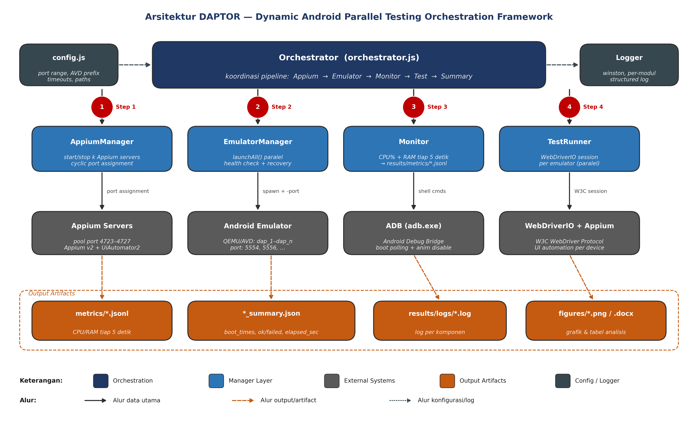
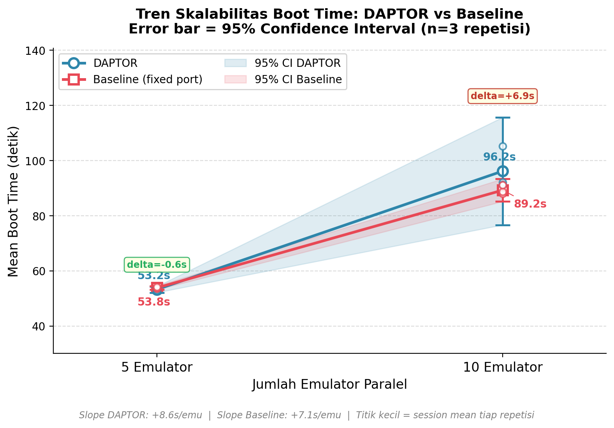
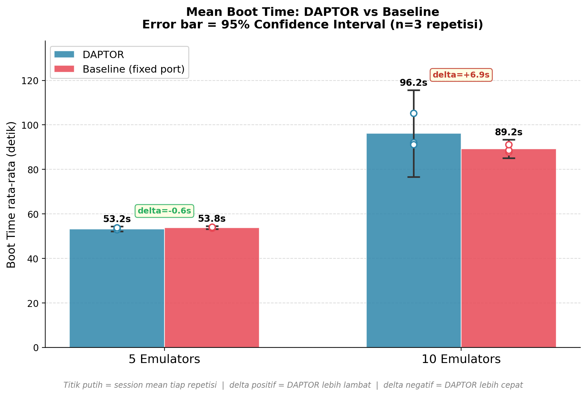

# DAPTOR

Dynamic Android Parallel Testing Orchestrator is a CLI tool for launching and coordinating multiple Android emulators with dynamic ADB and Appium port assignment.

## Problem

Running Android automation at scale is painful. Emulator boot time is expensive, port conflicts are common, and manual coordination between ADB, Appium, and test runners quickly becomes unreliable when several devices are launched at the same time.

## Solution

DAPTOR automates the orchestration layer for Android test environments by:

- assigning ADB ports dynamically
- distributing Appium sessions across a reusable port pool
- launching multiple AVDs in parallel
- monitoring resource usage during execution
- exposing ready-to-use device and Appium port mappings for downstream test runners

## Tech Stack

- Node.js
- Appium
- Android SDK
- ADB
- WebdriverIO
- CLI-based orchestration

## Key Features

- Dynamic ADB port assignment to reduce collision risk
- Parallel emulator launch workflow for large test batches
- Appium pool management for controlled resource allocation
- Graceful shutdown for emulator and Appium cleanup
- Benchmark documentation with architecture and scalability visuals
- Example integration for automation scripts via WebdriverIO

## Architecture



## Benchmark Snapshot





Based on the included benchmark study:

- 5 emulators reached an average boot time of about 53 seconds
- 10 emulators reached an average boot time of about 96 seconds
- success rate stayed at 100 percent
- port conflicts remained at zero across the observed runs

More detail is available in [docs/BENCHMARKS.md](./docs/BENCHMARKS.md).

## How To Run

1. Install the prerequisites:

- Android SDK with `adb` and `emulator` available in your `PATH`
- Node.js 18 or newer
- Appium installed globally
- Pre-created Android Virtual Devices

2. Install the project dependencies:

```bash
git clone https://github.com/gumaygo/daptor.git
cd daptor
npm install
```

3. List the available AVDs:

```bash
emulator -list-avds
```

4. Launch multiple emulators in parallel:

```bash
node bin/daptor.js Pixel_5_API_33 Pixel_6_Pro_API_34 My_Tablet_AVD
```

5. Connect your automation suite to the generated Appium ports.

See [examples/basic-test.js](./examples/basic-test.js) for a minimal WebdriverIO example.

## Sample Output

```text
[DAPTOR] Starting orchestration for 3 instances...
[DAPTOR] All emulators ready:

┌─────────┬─────────────────────┬────────────┐
│ deviceId│ emulator-5554       │ 4723       │
│ deviceId│ emulator-5556       │ 4724       │
│ deviceId│ emulator-5558       │ 4725       │
└─────────┴─────────────────────┴────────────┘
```

## Impact

- Removes repetitive setup work from Android automation pipelines
- Makes parallel device execution more reliable and easier to scale
- Demonstrates practical QA automation engineering beyond test scripts alone

## License

MIT
